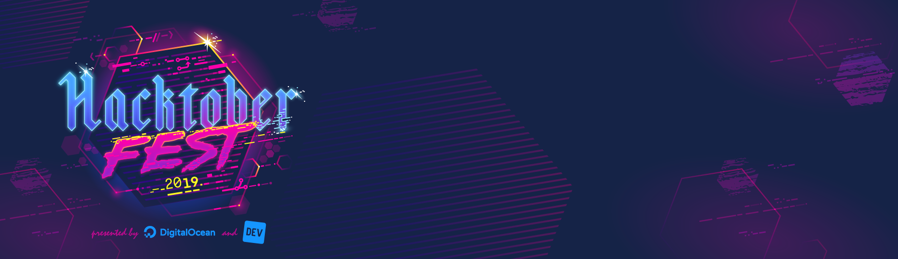

This repository is for anyone to create pull requests during Hacktoberfest 2019.

# Open Sauce Project 2019

Happy Hacktoberfest. Please create a new markdown file inside the [sauces](sauces/) directory with a recipe for your sauce.

## Example Sauce

Check out the [Homemade Heinz-style Ketchup](sauces/homemade-heinz-style-ketchup.md) by [chefsteps.com](https://chefsteps.com). You can copy this format, or make it whatever format you'd like.

## Reference Links

How do I track my progress to get an awesome shirt from Hacktoberfest 2019?
- Go to : https://hacktoberfest.digitalocean.com/
